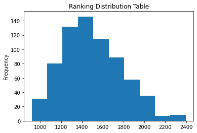

# 4-Player ELO Simulation

### This simulation takes in 2 parameters: `# of competitors` & `# of rounds`

#### I wanted to create a game that allows a user to pick their favorite choice out of four options. By picking their favorite, the winning compitor should go up in rank, while the losing compitors propotionately decrease in rank.

### Instructions

> 1. Clone Repo: `git clone git@github.com:P-Carth/Multiplayer-ELO-Simulation.git`
>
> 2. Open `ELO_Simulation.ipynb` in Jupyter Lab
>
> 3. Run the first 4 code blocks
>
> 4. The 5th code block begins the simulation, where it will ask you to input `# of rounds` and `# of competitors`
>
> 5. Finally, run the last code block to view the simulation's analysis

### Results & Discussion

> While I was successful in creating a normally distributed 4-Player ELO System, it does seem that there is a consistent skew to the right. Fortunately, for my purposes this is not an issue.

> This algorithm can be applied to a number of scenarios to compare competitors in an adjusted and fair manner. For example, I applied this algorithm to an NFT game that I made with Flask that allows users to vote on their favorite NFT (<i>shown below<i>).

