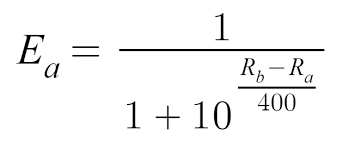
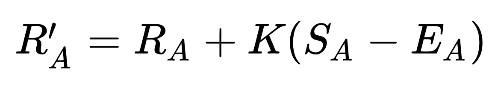

# 4-Player ELO Simulation

### This simulation takes in 2 parameters: `# of competitors` & `# of rounds`

#### I wanted to create a game that allows a user to pick their favorite choice out of four options. By picking their favorite, the winning compitor should go up in rank, while the losing compitors propotionately decrease in rank.

## ELO Algorithm

### I based this 4-player ELO off of the standard 2-player ELO Algorithm used on most chess websites:

 
##### Ea = probability of `player a` winning
##### Ra = Rating of `player a`; Rb = Rating of `player b`
##### RA = Rating before; R'A = Rating After
##### SA = `1` if player is winner; SA = `0` if player is loser

### The resulting 4-player version of this alogirthm is as follows:

### Ea1 = (1/(1+10(r2-r1)/400) + 1/(1+10(r3-r1)/400) + 1/(1+10(r4-r1)/400))/6
### Ea2 = (1/(1+10(r1-r2)/400) + 1/(1+10(r3-r2)/400) + 1/(1+10(r4-r2)/400))/6
### Ea3 = (1/(1+10(r1-r3)/400) + 1/(1+10(r2-r3)/400) + 1/(1+10r4-r3)/400))/6
### Ea4 = (1/(1+10(r1-r4)/400) + 1/(1+10(r2-r4)/400) + 1/(1+10(r3-r4)/400))/6

#### R'A1 = round(RA1 + k(SA - Ea1))
#### R'A2 = round(RA2 + k(SA - Ea2))
#### R'A3 = round(RA3 + k(SA - Ea3)) 
#### R'A4 = round(RA4 + k(SA - Ea4))

## Instructions

> 1. Clone Repo: `git clone git@github.com:P-Carth/Multiplayer-ELO-Simulation.git`
>
> 2. Open `ELO_Simulation.ipynb` in Jupyter Lab
>
> 3. Run the first 4 code blocks
>
> 4. The 5th code block begins the simulation, where it will ask you to input `# of rounds` and `# of competitors`
>
> 5. Finally, run the last code block to view the simulation's analysis

## Results & Discussion

> While I was successful in creating a normally distributed 4-Player ELO System, it does seem that there is a consistent skew to the right. Fortunately, for my purposes this is not an issue.

> This algorithm can be applied to a number of scenarios to compare competitors in an adjusted and fair manner. For example, I applied this algorithm to an NFT game that I made with Flask that allows users to vote on their favorite NFT (<i>shown below<i>).

